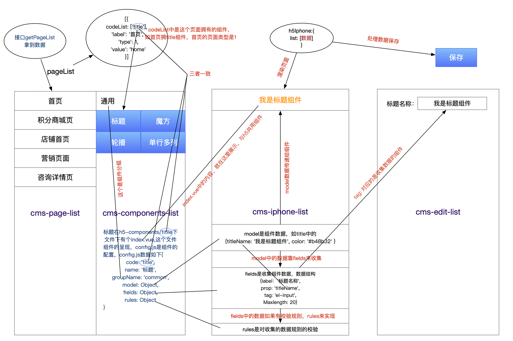
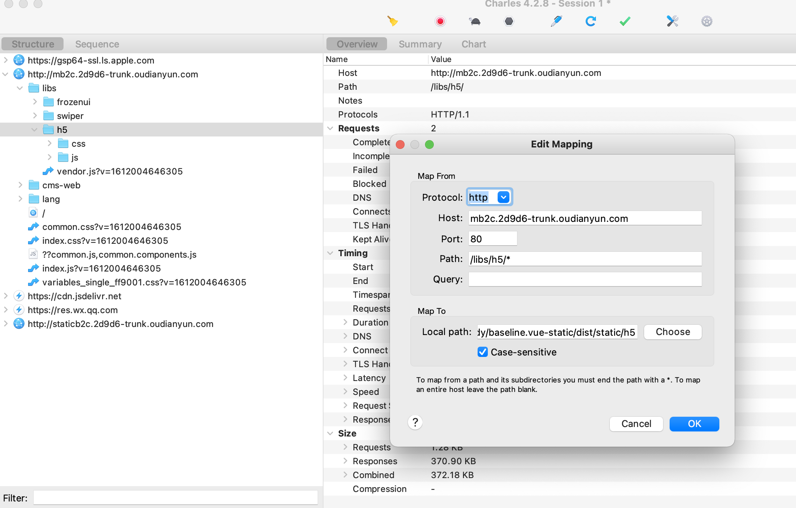

### h5端cms开发介绍

#### 流程图



#### 页面结构

> 按钮：返回、复制页面、页面设置、预览、保存、立即发布、定时发布 

> 页面： 首页、积分商城页、店铺首页、营销页、咨询详情页

> 组件：通用组件若干、导航组件若干、营销组件若干、商品组件若干

> 显示区域：显示页面组件、可以拖拽、上下移动、删除、显示设置、首页独有Header组件和Footer设置

> 设置区域：用于收集数据，可以显示页面设置，各个组件的设置，Footer设置

```
整个页面在 views/h5-edit/index.vue 可以查看 这个页面接受后端数据、处理数据给后端
```

#### 页面

`cms-page-list`组件展示

```javascript
// 接受的值的类型如下 codeList表示这个类型页面可以展示的组件
// 如果写一个组件就要在数据库中codeList插入这个组件的组件名
[{
  'codeList': [
    'title',
    'search',
    'slider',
    'video',
    'rich-text',
    'cube',
    'h5-multipic',
    'slide-show',
    'img-map',
    'bulletin',
    'goods-recommend',
    'spacing',
    'goods-r1c1b',
    'goods-r1c1s',
    'goods',
    'goods-r1c3',
    'goods-r1cn',
    'count-down',
    'rank-landing-page',
    'multi-coupons',
    'channel',
    'tabs',
    'header'
  ],
  'label': '首页',
  'type': 1,
  'value': 'home'
}]
```

#### 组件

`cms-components-list`组件展示

```javascript
// 这个是goods组件 在h5-components中 index.vue 是组件本身
// code 是这个组件的标识，和pageList中的codeList数组中的字段对应，和组件名对应
// groupName 组件分组 这个页面会处理
// model 这个是要保存后后端供前端使用的数据
// fields 设置可以设置当前组件的属性 prop对应的是model中的值 tag对应的是当前的组件名 label是描述 其余的是传给组件的属性
// rules 设置属性的时候的必填项目
export default {
  code: 'goods',
  name: '一行两列',
  groupName: 'goods',
  model: {
    displayNum: 100,
    dataSortRole: 0, // 排序
    customName: null, // 栏目名称
    displayBuyBtn: true, // 显示购买按钮
    displayEvaluate: true, // 显示评论
    displayNav: true, // 显示商品分类导航
    goodsType: 0, // 选品方式
    dataChange: 0, // 监听这个值 改变编辑H5Iphone的时候的数据
    use: [] // 栏目有效期 -- 和以前字段不一致之前是startDate 和 endDate
  },
  fields: [
    {
      label: '栏目名称',
      prop: 'customName',
      tag: 'el-input',
      maxlength: '20',
      showWordLimit: true
    },
    {
      label: '栏目有效期',
      prop: 'use',
      tag: 'el-date-picker',
      type: 'datetimerange',
      'value-format': 'yyyy-MM-dd HH:mm:ss',
      clearable: false
    },
    {
      label: '商品展示数',
      prop: 'displayNum',
      tag: 'el-input'
    },
    {
      label: '商品排序规则',
      prop: 'dataSortRole',
      tag: 'el-select',
      children: [
        {
          label: '自定义排序',
          value: 0,
          tag: 'el-option'
        },
        {
          label: '按价格从高到低',
          value: 1,
          tag: 'el-option'
        },
        {
          label: '按价格从低到高',
          value: 2,
          tag: 'el-option'
        },
        {
          label: '按销售量从高到低',
          value: 3,
          tag: 'el-option'
        },
        {
          label: '按销售量从低到高',
          value: 4,
          tag: 'el-option'
        }
      ]
    },
    {
      label: '显示购买按钮',
      prop: 'displayBuyBtn',
      tag: 'el-switch',
      'active-value': true,
      'inactive-value': false
    },
    {
      label: '显示分类导航',
      prop: 'displayNav',
      tag: 'el-switch',
      'active-value': true,
      'inactive-value': false
    },
    {
      label: '显示评论',
      prop: 'displayEvaluate',
      tag: 'el-switch',
      'active-value': true,
      'inactive-value': false
    },
    {
      label: '选品方式',
      prop: 'goodsType',
      tag: 'cms-choose-goods-type'
    },
    {
      label: '',
      prop: '',
      tag: 'cms-choose-goods'
    }
  ],
  rules: {
    customName: [
      { required: true, message: '请输入栏目名称', trigger: 'blur' }
    ]
  }
}
```

#### 显示区域

`cms-h5-iphone`组件展示

```vue
// h5-iphone  
// 拖拽组件draggable
// h5Iphone.list 这个就是选择的组件储存在这个地方
// component 渲染组件 组件名和code必须一样
<ody-draggable
  :list="h5Iphone.list"
  group="people"
  style="minHeight: 667px"
  @change="updateMessge"
>
  <div
    v-for="(item, index) in h5Iphone.list" 
    :key="item.code"
    :ref="'active'+index"
    :class="{'active': index === h5Iphone.index, 'has-error': item.hasError}"
    name="handleChangeIndex"
    class="list-group-item"
    @click="handleChangeIndex(index)"
  >
    <component :ref="item.code" :is="'cms-' + changeCase(item.code)" :model="item.model" :item-data="item" :operation="operation" :base-config="baseConfig"/>
  </div>
</ody-draggable>
```

#### 设置区域

> cms-edit-list组件 页面设置

> cms-edit-page组件 组件设置

> cms-edit-footer组件 footer设置

#### 与H5的关系

与h5共用一套组件代码

1. 开发阶段，后台启用**npm run dev-h5** 打包生成**dist/static/h5**； 将h5中的**/libs/h5** 用花瓶代理到打包生成的**dist/static/h5**下， 开始联调，如图：

   

2. 发布阶段，后台启用**npm run build-h5** 打包生成**dist/static/h5**；将**dist/static/h5** 代替h5中的**/libs/h5**，上线h5代码

#### 与APP和小程序的关系

小程序和app要写出自己对应的组件

### pc端cms开发介绍

1.pc端的构造和h5端一样，理解了h5端，pc端懂了

2.唯一不同的是组件不是共用的，商家后台写的组件，实际上pc端也要再写一下，因为pc端的代码是angular

### 如何写一个组件

写一个title组件示例

|                              1                               |                         2                         |                      3                       |                    4                     |                  5                  |
| :----------------------------------------------------------: | :-----------------------------------------------: | :------------------------------------------: | :--------------------------------------: | :---------------------------------: |
| 在h5-components中创建一个title文件夹，index.vue是组件的呈现方式，config.js是要收集的数据 | 通知后台让页面关联组件，就是在codeList中加入title | Ui方面提供一下选中和非选中状态组件的icon图片 | H5端和商家后台用的是同一个组件，要兼容H5 | 小程序端和app端则分别写出相应的组件 |

